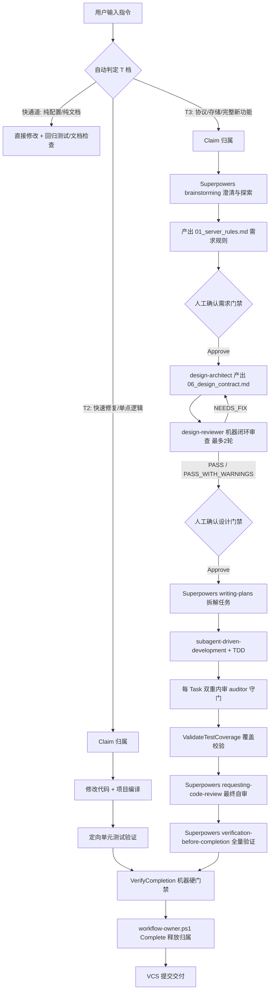

# Superpowers 自动化开发指南

本指南说明多个 harness（Claude Code / GitHub Copilot / Antigravity / Cursor / Pi）如何使用本项目的 AI SOP 完成游戏服务端开发。**T3 由 Superpowers 过程引擎编排；T2/T1/快通道用 AGENTS.md + 专家 Skills，不调用 Superpowers**。领域专家 Skill 被强制绑定调用；详见 `.ai-sop/workflows/superpowers-adapter.md`。各 harness 共享 `.ai-workspace/context/` 与规范化功能产物。各工具的能力差异（能跑 T3 还是只 T2）见 `.ai-sop/scripts/harness-capability.ps1` 的 STRICT/BLOCKED 判定。

## 🧭 用户任务极简判定树

- 🐛 **日常 Bug 修复 / 单点逻辑微调** $\rightarrow$ 说 `快速修改：...`（自动按 T2 单命令直达，不打断）
- 📄 **纯数值微调 / 错别字润色** $\rightarrow$ 直接改（自动按快通道秒级生效）
- ✨ **新玩法活动 / 协议变更 / 存储改动** $\rightarrow$ 描述功能目标（自动按 T3 展开，需需求+设计两道确认）
- 📑 **超复杂策划案** $\rightarrow$ 选用 `requirement-analyst` 预处理提取 BR 条款

## 为什么不需要声明流程模式

各 harness 统一以 Superpowers 为过程引擎（仅 T3）。用户只需描述任务，Superpowers 会自动选择对应的过程 Skill：

| 任务形态 | Superpowers 自动选择的 Skill |
|---|---|
| 新功能或行为变更 | `brainstorming` |
| bug 与异常行为 | `systematic-debugging` |
| 需求/设计批准后实现 | `writing-plans` -> `subagent-driven-development` + `test-driven-development` |
| 交付前验证 | `verification-before-completion` |

**不要手动激活 `workflow-orchestrator` 作为顶层调度器**。它是 T3 主流程之外的**人工手动片段编排器**（当前用于全功能审计，可扩展），不是完整功能从需求到交付的调度器。完整 T3 功能统一走 Superpowers。

## 工作流概览

主流程为 Superpowers 原生骨架；领域专家 Skill 作执行单元/校验组件，不作流程节点。



需求与设计是两道独立门禁（默认两道独立确认，仅当符合 T3 小改动合并呈递豁免时允许一次呈递写入两道 SHA）；brainstorming 可连续产出 01→06 后呈递确认。设计产出后由 `design-reviewer` 机器闭环自审自修（不占人工时间），通过后才交人工确认；不前置 QA 测试计划（TC 在 TDD 中产出，覆盖校验在实现后）；`implementation-auditor`/`logic-auditor` 是 subagent 内审执行单元，非实现后独立节点。复杂大功能交付后可**手动**触发全功能审计（见后文）。

### 执行强度档位（T 档）与提示词指定

流程强度**按变更类默认 + 用户可显式指定 + 工具上限**，见 AGENTS.md「执行强度分层」档位表（行为/契约/协议/存储=T3；缺陷/单点=T2；纯数值/纯文档=快通道）。用户显式档位优先于变更类默认。

| 档 | 提示词怎么说 | 跳过 |
|---|---|---|
| **T3** | 新玩法/协议/存储：直接描述任务 | 不跳，走完整流程 |
| **T2 快速** | “**快速修改**”/“**简单需求直接实现**”/“这个不用走完整流程” | brainstorming、需求确认、design-reviewer、设计确认、writing-plans；保留归属+编译+验证+回归 |
| **T1 急速** | “**急速修改**”/“**直接改**”/“极速”（极少用，AI 先提醒风险确认） | 全部流程节点；仅保留编译+guard 逃生口 |
| **快通道** | 不用说（AI 自动识别纯配置数值/纯文档） | 需求与设计门禁 |

日常快速修改用 **T2**（多 2-3 分钟但带验证+回归，更安全）；T1 仅极端场景（如改日志级别/临时开关）。**协议字段名变更不是 T1/T2，是 T3。** BLOCKED 工具（Pi）只能 T2；STRICT 工具（Claude Code/Cursor/Copilot/Antigravity）可跑 T3。

## 人机交互约定

- 每轮最多 3 个关键问题，允许用户一句话给齐。
- 对有意义的备选方案进行比较并推荐其一。
- 需求与设计可多轮澄清与分段确认。
- 只有完整的 `01_server_rules.md` 与 `06_design_contract.md` 需要最终确认。
- 设计最终确认后，测试计划、审计、实现、验证、修复与回归自动连续完成，不再增设批准检查点。
- 当任务可独立 review 时，默认采用 `subagent-driven-development`，不让用户选择执行策略。

功能开始时自动 Claim 归属，并生成一个不可变 owner ID 持久化到 Superpowers ledger。三 harness 统一使用 `SUPERPOWERS` 归属，`agent` 字段区分实际工具。同一功能从开始到交付使用同一身份。

```powershell
pwsh -NoProfile -File .\.ai-sop\scripts\workflow-owner.ps1 -Operation Claim `
  -SpecDirectory ".ai-workspace\specs\features/<FeatureName>" `
  -Feature "<FeatureName>" `
  -Workflow SUPERPOWERS `
  -Agent "<CLAUDE_CODE|COPILOT|ANTIGRAVITY|CURSOR|PI>" `
  -OwnerId "<superpowers-run-id>"
```

`agent` 值取自实际工具，而非底层模型。注意 PI 因核心无 subagent，能力准入判定为 BLOCKED（只 T2，不能跑自动 T3 独立审查），其 Claim 经 `pi-adapter/bootstrap-pi-session.ps1` 注册 session。*注意：已有 01/06 规格产物的功能目录，后续修改均按 T3 门禁收尾（`VerifyCompletion` 自动升档校验）；若对已有功能进行 T2 快速热修，请开新 FeatureName（如 `HotfixShopLimit20260821`）。*

恢复任务或开始新的修改批次前用同一身份执行 `Validate`；功能成功交付后执行 `Complete`。失败或阻塞时不要 Complete，以便原会话恢复：

```powershell
pwsh -NoProfile -File .\.ai-sop\scripts\workflow-owner.ps1 -Operation Validate `
  -SpecDirectory ".ai-workspace\specs\features/<FeatureName>" `
  -Feature "<FeatureName>" -Workflow SUPERPOWERS `
  -Agent "<CLAUDE_CODE|COPILOT|ANTIGRAVITY|CURSOR|PI>" -OwnerId "<superpowers-run-id>"

pwsh -NoProfile -File .\.ai-sop\scripts\workflow-owner.ps1 -Operation Complete `
  -SpecDirectory ".ai-workspace\specs\features/<FeatureName>" `
  -Feature "<FeatureName>" -Workflow SUPERPOWERS `
  -Agent "<CLAUDE_CODE|COPILOT|ANTIGRAVITY|CURSOR|PI>" -OwnerId "<superpowers-run-id>"
```

## 生产代码编辑 Guard

PreToolUse hook 在每次文件编辑前运行 `guard-production-edit.ps1`（同一脚本跨所有 harness：Claude Code 经 `.claude/settings.json`，其它经 `.agents/hooks.json`/`.cursor/hooks.json`/`.github/hooks/ai-sop.json`，hook 命令统一指向 `./.ai-sop/scripts/hook-dispatcher.ps1`）。编辑 `src\com\**`、`WebRoot\**`、`config\**` 前，必须存在 ACTIVE 的 `SUPERPOWERS` owner。guard 异常时可手动关（`.ai-sop/.guard-disabled` 开关文件），详见《AI SOP 使用指南》。

`AI_SOP_SKIP_OWNER_GUARD=1`（或旧版 `SERVER_NEW_SKIP_OWNER_GUARD=1`）仅作为非功能型一次性小改（临时 hot-fix、探索性 probe）的逃生口。为绕过某次功能运行的归属而设置它是流程违规。

## 多功能并行开发

每个功能使用独立 Agent 会话和独立 SVN 工作副本（`svn checkout` 到独立目录）。不要在同一工作目录运行两个功能。

```powershell
pwsh -NoProfile -File .\.ai-workspace\scripts\feature-runtime.ps1 `
  -Operation Allocate -Feature "<FeatureName>" -WorkspacePath $PWD
```

每个功能获得独立端口、发布目录、`CATALINA_BASE`、日志和 BaseUrl。当前 Redis/Mongo 仍共享，因此代码、编译和 JUnit 可并行，正式 Tomcat/JSP 业务验证由机器级锁串行执行。详见 `.ai-workspace/workflows/parallel-development.md`。

## 使用模板

以下模板可直接复制，替换 `<...>` 即可。Claude Code 会自动走 Superpowers，无需手动声明 Skill。

只要任务涉及 `<FeatureName>`，提示词就应同时携带：

```text
规格目录：.ai-workspace/specs/features/<FeatureName>/。
```

功能名只用于定位任务，规格目录中的原始需求、`01_server_rules.md` 和 `06_design_contract.md` 才是业务规则与技术契约依据。

原始需求可直接粘贴，也可使用 `.md`、`.txt` 或 `.docx` 文件。旧版 `.doc` 需先转换，不得直接按 `.docx` 解压解析。

### 1. 完整新功能开发

```text
开发新功能 <FeatureName>。
需求资料位于 .ai-workspace/specs/features/<FeatureName>/。
按完整流程执行；除需求和设计确认外，其余阶段自动连续完成。
```

Superpowers 会从 `brainstorming` 开始。用户只需在生成 `01_server_rules.md` 和 `06_design_contract.md` 后分别确认。

### 2. 尚未整理规格资料的新功能

```text
开发新功能 <FeatureName>。
规格目录：.ai-workspace/specs/features/<FeatureName>/。
原始需求如下：
<粘贴需求内容>

请先将原始需求整理到规格目录并生成需求规则，按完整流程执行。
```

### 2a. 复杂 docx 需求预处理（可选前置）

策划给出复杂 `.docx`（混合客户端/美术/服务端需求）时，可**手动**先调用 `requirement-analyst` 预处理，产出服务端需求草案，再进 Superpowers brainstorming 定稿。

```text
使用 requirement-analyst 预处理 <FeatureName> 的策划资料。
规格目录：.ai-workspace/specs/features/<FeatureName>/。
策划文档位于 <docx 路径，已放入规格目录或给出绝对路径>。

请读取该 docx，剥离客户端与美术部分，提炼服务端需求，
产出 00_server_rules_draft.md（草案，非正式契约）。完成后停止，
列出待确认/模糊点，待我确认后进入 Superpowers brainstorming 定稿。
```

草案就绪后，用模板 1 启动 brainstorming，它会基于 `00_server_rules_draft.md` 交互澄清并定稿 `01_server_rules.md`。简单需求可跳过本步，直接 brainstorming。

### 3. 功能维护或需求调整

```text
调整 <FeatureName>。
本次调整内容：
<变更说明>

现有规格目录：.ai-workspace/specs/features/<FeatureName>/。
请先判断属于业务规则、技术契约、实现修复还是纯配置调整，再按对应流程执行。
```

业务规则变化进入需求确认，技术契约变化进入设计确认，纯实现修复不增加人工门禁。

### 4. 明确的业务规则调整

```text
调整 <FeatureName> 的业务规则。
规格目录：.ai-workspace/specs/features/<FeatureName>/。
调整内容：
<新的业务规则、公式、限制、状态或异常反馈>

请更新需求规则，并在人工确认后继续设计重校验和后续自动化流程。
```

### 5. 明确的技术契约调整

```text
调整 <FeatureName> 的技术契约。
规格目录：.ai-workspace/specs/features/<FeatureName>/。
调整内容：
<协议、存储结构、兼容策略、跨系统边界或实现方案变化>

现有需求规则不变。请更新设计契约，并在人工确认后自动完成测试计划、实现、审计和验证。
```

若分析发现调整同时改变业务语义，仍会先回到需求确认。

### 6. 实现偏差或指定代码修复

```text
修复 <FeatureName> 的实现偏差。
规格目录：.ai-workspace/specs/features/<FeatureName>/。
现象或问题：
<问题说明>

已确认需求和设计不需要修改。请完成回归用例、修复、编译、审计和自动化验证。
```

Superpowers 会复核“无需修改需求和设计”是否成立，不会仅根据提示词绕过人工门禁。

### 7. 纯配置数值调整

```text
调整 <FeatureName> 的配置数值。
规格目录：.ai-workspace/specs/features/<FeatureName>/。
调整项：
<配置文件、配置 ID、字段、旧值和新值>

业务语义、协议和存储结构不变。请执行配置检查和受影响场景回归。
```

### 8. 单个 Bug 排查

```text
排查 <FeatureName> 的 Bug。
规格目录：.ai-workspace/specs/features/<FeatureName>/。
问题现象：
<复现步骤、预期结果、实际结果和已有证据>

请先完成服务端判责；只有实现缺陷才修改代码，并自动完成回归、审计和验证。
```

Superpowers 会用 `systematic-debugging` 先定位根因。只有实现缺陷才修改代码；需求/设计缺陷回到对应人工确认；客户端、测试或无效问题只输出证据。

### 9. Bug 列表批量处理

```text
处理 <FeatureName> 的 BUGS.md。
规格目录：.ai-workspace/specs/features/<FeatureName>/。
Bug 文件位于 <BUGS.md 路径>。
请逐条判责、逐条输出结论；实现缺陷自动修复并回归，其他问题只输出证据。
```

实现缺陷自动进入测试计划、修复、审计和回归；客户端、测试或无效问题只输出证据。

### 10. 长周期大功能拆分

适用于一次改版/大功能无法一蹴而就、需拆成多个子功能分阶段交付的场景。**先拆功能级子项目到文档，再让每个子功能独立走完整 Superpowers 流程**（Superpowers 的 `writing-plans` 拆的是实现任务，不是功能级拆分，故需本前置）。

```text
长周期大功能 <FeatureName> 改版。
规格目录：.ai-workspace/specs/features/<FeatureName>/。
原始改版需求如下：
<粘贴改版需求>

本次为长周期任务，不要一蹴而就。请按以下步骤：
1. 先分析现有代码与逻辑，整理"现状基线"到规格目录（供改版对照）。
2. 通过 brainstorming 逐步确认改版需求与边界，产出改版总纲文档。
3. 将改版拆分为若干可独立交付的子功能（子功能级，非实现任务级），
   拆分计划写入文档，明确子功能间依赖与交付顺序。
4. 暂不实现。拆分计划待我确认后，每个子功能再各自独立走完整
   Superpowers 流程（需求→设计→design-reviewer 审查→确认→实现→审计→验证）。
```

拆分计划确认后，对每个子功能用模板 1（完整新功能开发）启动，规格目录用各子功能自己的目录。每个子功能独立 Claim 归属、独立交付，互不阻塞（可并行，遵循 `.ai-workspace/workflows/parallel-development.md`）。全部子功能完成后，可用模板 11（全功能审计）做跨子功能的全盘收尾审计。

### 11. 全功能审计（手动，人工把关）

复杂大功能交付后手动触发跨任务全盘审计，查契约一致性与整体游戏状态正确性。`audit_fix_policy` 取 `REPORT_ONLY`（只出报告）或 `AUTO_REPAIR`（自动修复并回归）。完整模板见后文 **"全功能审计"** 段。

### 12. 对指定类执行全盘审计

```text
对指定类执行全盘审计。
目标类：<完整类名>。
文件路径：<类文件路径>。
所属功能：<FeatureName>。
规格目录：.ai-workspace/specs/features/<FeatureName>/。

依次执行 implementation-auditor 和 logic-auditor。
audit_fix_policy=REPORT_ONLY。
审计范围仅限目标类及其必要的直接调用链，不扩大到整个仓库，不修改代码。
```

如果该类不归属于某个具体功能，可以删除“所属功能”和“规格目录”两行，但必须提供类文件路径和必要的契约来源。

### 13. 对指定类的方法执行全盘审计

```text
对指定方法执行全盘审计。
目标类：<完整类名>。
文件路径：<类文件路径>。
目标方法：<方法名及参数签名>。
所属功能：<FeatureName>。
规格目录：.ai-workspace/specs/features/<FeatureName>/。

依次执行 implementation-auditor 和 logic-auditor。
audit_fix_policy=REPORT_ONLY。
以目标方法、分支和必要调用链为审计边界，不扩大到整个类或仓库，不修改代码。
```

### 14. 只执行实现审计

```text
仅执行 implementation-auditor。
审核范围：<类、方法、文件列表或变更集>。
重点检查：<契约一致性、架构规范、性能、兼容性等；可省略>。
只输出审计报告，不修改代码。
```

### 15. 只执行高风险逻辑审计

```text
仅执行 logic-auditor。
审核范围：<类、方法或核心链路>。
重点检查：<状态机、复杂分支、结算、幂等、补偿、资源扣除等>。
只输出审计报告，不修改代码。
```

### 16. 只生成或更新测试计划

```text
仅执行 quality-assurance 的 PLAN 阶段。
功能：<FeatureName>。
规格目录：.ai-workspace/specs/features/<FeatureName>/。
只生成或更新测试计划，不进入实现。
```

### 17. 只执行 QA 验证

```text
仅执行 quality-assurance 的 VERIFY 阶段。
功能：<FeatureName>。
规格目录：.ai-workspace/specs/features/<FeatureName>/。
验证范围：<测试计划、用例、Bug 回归 Case 或目标场景>。
只执行验证并输出证据，不自动扩大到完整开发流程。
```

### 18. 只做需求分析

```text
仅执行 requirement-analyst。
功能：<FeatureName>。
规格目录：.ai-workspace/specs/features/<FeatureName>/。
原始需求资料位于 <资料路径；若已在规格目录中可删除本行>。
生成或更新需求规则后停止，等待人工确认。
```

### 19. 只做技术设计

```text
仅执行 design-architect。
功能：<FeatureName>。
规格目录：.ai-workspace/specs/features/<FeatureName>/。
需求规则已经有效确认。生成或更新设计契约后停止，等待人工确认。
```

### 20. 人工确认后继续

需求确认：

```text
确认当前 01_server_rules.md。
```

设计确认：

```text
确认当前 06_design_contract.md。
```

Superpowers 会校验当前文件、写入归属与确认状态，然后自动继续，不需要用户再次激活后续阶段。

### 21. 普通文档修改

```text
修改文档 <文件路径>。
修改目标：
<文档调整内容>

本次不改变业务规则和技术契约。完成文档检查后停止。
```

如果实际修改触及业务规则或技术契约，应重新分类，不能继续按普通文档任务处理。

## 领域专家调用（执行单元，非流程节点）

领域专家 Skill 是 Superpowers 的**执行单元**（subagent 派发）与**咨询/校验组件**，不是流程节点。使用其领域 checklist 与交付格式，把发现返回给 Superpowers controller，不接管编排、不写 `.ai-sop/runtime/`：

| 角色（执行单元/咨询） | 专家 Skill |
|---|---|
| 实现者 | `implementation-engine` |
| 每 Task 内审（实现/契约合规） | `implementation-auditor` |
| 每 Task 内审（高风险分支/状态/语义） | `logic-auditor` |
| 设计方案审查（人工确认前，机器闭环） | `design-reviewer` |
| 需求预处理（可选手动前置，复杂 docx） | `requirement-analyst` |
| 架构/契约设计（brainstorming 咨询） | `design-architect` |
| 测试覆盖校验（实现后） | `quality-assurance` / `test-plan-auditor` |

任何编辑规范产物的专家调用都属于修改型工作，需要活动的 Superpowers owner ID；只读的咨询性 review 不需要。

## 审计门禁（三层，职责不重叠）

| 层 | 何时 | 视角 | 执行 |
|---|---|---|---|
| 单任务内审 | 每个 Task（subagent 内） | spec 合规 + 代码质量 + 高风险逻辑 | `implementation-auditor`/`logic-auditor` 作执行单元 |
| 整体收尾 | 全部 Task 后 | 流程合规 + 整体一致性 | Superpowers `requesting-code-review` |
| 全功能审计（可选手动） | 交付后按需 | 跨任务契约一致 + 整体游戏状态正确性 | `workflow-orchestrator` AUDIT_ONLY 全盘（见下） |

- 单任务内审：`implementation-auditor` 覆盖实现/契约合规；状态机、奖励结算、多资源扣除、兼容补偿、重试幂等等高风险项路由 `logic-auditor`。审查发现问题 → 修复 → 重新审查 → 通过才标记完成。
- 业务代码修复后必须重新编译、重新审查、重新验证。
- QA 完成标准是已规划的覆盖场景返回成功，而不是仅编译通过或服务启动成功。

## 测试覆盖

TC 在 TDD 中随实现产出。实现后运行覆盖校验，确认需求/设计到用例的追溯完整：

```powershell
pwsh -NoProfile -File .\.ai-sop\scripts\workflow-state.ps1 -Operation ValidateTestCoverage `
  -Path ".ai-workspace\specs\features/<FeatureName>/05_test_coverage.json"
```

覆盖校验发现都自动修复。需求/设计缺口返回对应的人工确认阶段。

## 全功能审计（手动，人工把关）

单任务审计正确 ≠ 整个功能跨任务正确。复杂大功能交付后，可**手动触发**全盘审计，查跨任务的契约一致性、高风险逻辑与整体游戏状态正确性。

`workflow-orchestrator` 是 **Superpowers 主流程之外的人工手动片段编排器**：手动触发 → 按序调 `implementation-auditor`+`logic-auditor` → 汇总报告交人工 → 人工决定下一步（不自动推进）。`audit_fix_policy` 取 `REPORT_ONLY`（只出报告，**默认**，人工判断哪些改/哪些是允许的例外）或 `AUTO_REPAIR`（自动修复并回归）。不进主流程必经链。

## AUDIT-EXEMPT（审计例外声明）

工程实践存在"规则上不通过但有意允许"的反模式（如通常服务端不下发配置表给客户端，某些特殊场景允许）。这类有意例外在 `01_server_rules.md`/`06_design_contract.md` 条款行标 `[AUDIT-EXEMPT: 原因]`，**必须经人工确认**（随文档进门禁，不允许事后补）。审计见该声明对命中项降为 `INFO` 不阻断；理由须充分、范围须明确。与 `[TEST-EXEMPT]` 对称。

### 全盘审计，只出报告

```text
使用 workflow-orchestrator 对 <FeatureName> 执行全盘审计。
规格目录：.ai-workspace/specs/features/<FeatureName>/。
版本管理工具：<SVN 或 Git>。
提交版本范围：<起始版本/提交> -> <结束版本/提交或 WORKING>。

依次执行 implementation-auditor 和 logic-auditor。
audit_fix_policy=REPORT_ONLY。
本轮只审计、不修改代码、不进入 QA，完成后汇总所有发现、风险等级和证据。
```

### 全盘审计并自动修复

```text
使用 workflow-orchestrator 对 <FeatureName> 执行全盘审计。
规格目录：.ai-workspace/specs/features/<FeatureName>/。
版本管理工具：<SVN 或 Git>。
提交版本范围：<起始版本/提交> -> <结束版本/提交或 WORKING>。

依次执行 implementation-auditor 和 logic-auditor。
audit_fix_policy=AUTO_REPAIR。
实现缺陷自动修复，并重新编译、复审和执行目标回归；需求或设计缺口返回对应人工确认。
```

`AUTO_REPAIR` 修复生产代码后，须重新走内审与验证。

## 完成验证

交付前运行聚合测试与覆盖校验：

```powershell
pwsh -NoProfile -File .\.ai-sop\scripts\run-all-tests.ps1

pwsh -NoProfile -File .\.ai-sop\scripts\run-all-tests.ps1 -IncludeCompile
```

`run-all-tests.ps1` 默认只跑工作流脚本测试（快）；`-IncludeCompile` 额外跑 `gradlew compileJava`，用于完整交付门禁。全过 exit 0，否则非零。

### `.ai-sop` 脚本变更强制门禁

任何对 `.ai-sop/scripts/` 下脚本或其测试的修改，交付前**必须**本地跑 `run-all-tests.ps1` 且全过：

```powershell
pwsh -NoProfile -File .\.ai-sop\scripts\run-all-tests.ps1
```

这是本地的硬门禁（替代 GitHub CI）：失败必须先修复，不得跳过。它保证改动不会回归既有工作流脚本。新增脚本应同时新增 `*.tests.ps1`，聚合器会自动发现；对新脚本自身的首次提交，门禁适用于其后的变更。

最后由 Superpowers `verification-before-completion` 复查测试覆盖与所需项目测试。

## 完成定义与交付闭环

各档位完成条件与门禁硬指标统一以 [AGENTS.md「完成定义」](../AGENTS.md) 为单一真源。

### 交付闭环时序（硬时序约束）

```text
阶段 1（验证）：AI 运行 VerifyCompletion（硬门禁 100% 校验门禁 APPROVED、SHA、测试覆盖矩阵无占位、04_change_impact 有效；类型/公共分发扩展时再校验 8 切面完成度、编译产物）
  ↓
阶段 2（释放锁）：AI 运行 workflow-owner.ps1 -Operation Complete 释放工作流开发锁
  ↓
阶段 3（提交准备）：AI 自动执行 svn status/svn diff 核对改动，执行 svn add（新增文件）与 svn delete（删除文件）
  ↓
阶段 4（人工提交）：开发者人工审查变更并手动敲下 svn commit -m "<FeatureName>: <message>"
```

> **注意**：`svn commit` 绝不由 AI 自动执行，始终由人工审核后手动提交。

## 30 分钟从零完成一个功能（端到端实操演练）

以实现一个“商城限购”功能 `ShopBuyLimit` 为例，展示全流程交互：

### 第 1 步：下达开发指令
**用户**：
```text
开发新功能 ShopBuyLimit。
规格目录：.ai-workspace/specs/features/ShopBuyLimit/。
需求：增加商城物品每日限购功能，每个商品配置 daily_limit，玩家每天最多购买 daily_limit 次，次日 0 点重置。
```
**AI**：后台自动 Claim 归属，进入 `superpowers:brainstorming`，发起澄清提问（$\le 3$ 个聚焦问题）：
1. 限购计数存储在 Redis 还是 MongoDB？（推荐：Redis 记录当天购买次数，每日 0 点自动失效；购买成功同步记日志）
2. 超过限购时的错误码返回什么？（推荐：`SHOP_DAILY_BUY_LIMIT_EXCEEDED`）
3. 是否支持周限购或总限购扩展？（推荐：本次先实现日限购，接口预留限购类型枚举）

### 第 2 步：需求确认（第 1 道门禁）
**用户**：`同意你的推荐方案。`  
**AI**：生成 `01_server_rules.md`（包含 BR-1~BR-3, EX-1, AC-1~AC-2），呈递人工审核：
> `【待批准：requirement】回复“确认”写入门禁。`

**用户**：`确认`  
**AI**：后台调用 `workflow-state.ps1 -Operation Approve -Gate requirement` 写入批准状态与哈希。

### 第 3 步：设计与机器闭环审查（第 2 道门禁）
**AI**：调用 `design-architect` 产出 `06_design_contract.md` $\rightarrow$ 派发独立 `design-reviewer` 机器审查（0 BLOCKER/MAJOR，审查 PASS）$\rightarrow$ 呈递人工审核：
> `【待批准：design】回复“确认”写入门禁。`

**用户**：`确认`  
**AI**：后台调用 `workflow-state.ps1 -Operation Approve -Gate design` 写入批准状态与哈希。

### 第 4 步：计划、TDD 实现与内审（自动连续完成）
**AI**：自动执行 `writing-plans` $\rightarrow$ 生成 `05_test_plan.md` 并同步 `05_test_coverage.json` $\rightarrow$ 派发 `implementation-engine` 编写测试与实现代码 $\rightarrow$ 派发 `implementation-auditor` 和 `logic-auditor` 双重内审 $\rightarrow$ 运行 `ValidateTestCoverage` 校验 100% 覆盖。

### 第 5 步：收尾、验证与 SVN 交付准备
**AI**：调用 `requesting-code-review` 整体收尾 $\rightarrow$ 运行 `VerifyCompletion` 通过 $\rightarrow$ 调用 `workflow-owner.ps1 -Operation Complete` 释放锁 $\rightarrow$ 执行 `svn status`/`svn add`，输出变更总结并提示：
```text
✅ ShopBuyLimit 功能开发与全量验证已完成！
请人工核对改动并执行提交：
svn commit -m "ShopBuyLimit: 实现商城物品每日限购与跨天重置"
```

---

## 常见错误码与自愈速查表

| 错误标识 | 常见触发场景 | 自愈操作 / 解决方案 |
|---|---|---|
| `COMMAND_GRANT_NOT_FOUND` | 旧版脚本或外部 Hook 丢失 | 现已内置智能自愈，直接重新执行命令即可自动注册 Session 并补签 Grant。 |
| `WORKFLOW_OWNER_ALREADY_ACTIVE` | 前次未正常 Complete 或另一终端正持有锁 | 确认前次任务已结束，运行 `workflow-owner.ps1 -Operation ForceRelease -Feature <Name>` 释放遗留锁。 |
| `SESSION_INACTIVE` / `SESSION_TIMEOUT` | 本地 Session 超过 30 分钟超时 | 运行 `workflow-owner.ps1 -Operation RebindSession ...` 自动换绑新 Session 并恢复任务。 |
| `WORKFLOW_LOCK_TIMEOUT` | 并发文件锁竞争或磁盘 IO 延迟 | 检查是否有其他进程卡死，重新执行即可（脚本会自动进行指数退避重试）。 |
| `GATE_NOT_APPROVED` / `HASH_DRIFT` | 需求/设计文档批准后被非受控修改 | 纯文本润色运行 `workflow-state.ps1 -Operation UpdateHash -Gate <requirement\|design>`；业务修改运行 `ResetApproval` 后重新确认。 |
| `COVERAGE_UNCOVERED_CLAUSES` | 01/06 新增了 BR/DC 条款但 05 未覆盖 | 运行 `workflow-state.ps1 -Operation SyncCoverage` 同步用例，并在 05 中补齐条款 ID 关联。 |

