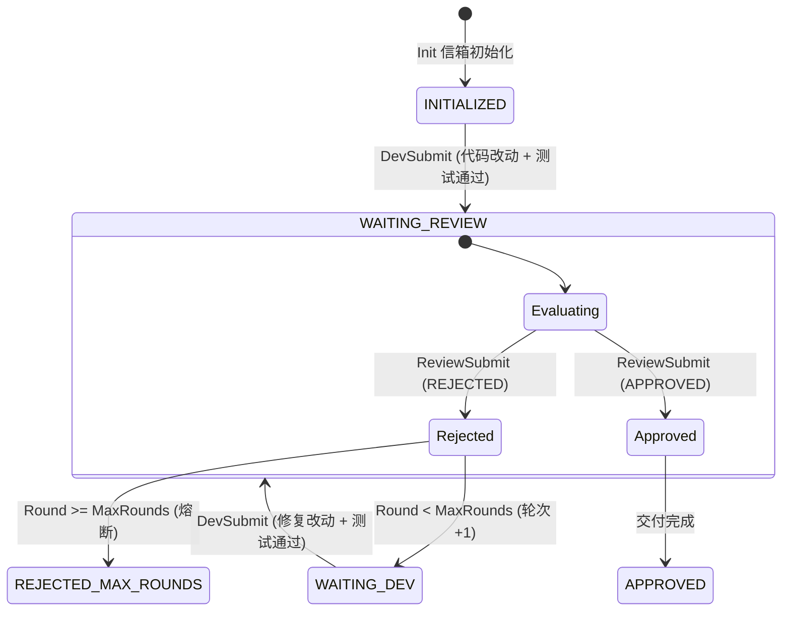

# 跨 Agent 协同审查工作流规范 (Dual-Agent Review Mailbox Protocol)

> 本规范为跨 Agent（如 **Antigravity 主开发** + **GitHub Copilot / Cursor / Claude Code 主审查**）提供**零环境侵入、各自会话保持、基于工作区 Git 变更与 JSON Schema 强契约**的标准化交替审查底座。

---

## 一、 核心架构与设计原则

1. **零环境侵入（Zero-Intrusion）**：
   - 不依赖额外后台 Daemon 或进程间端口通信；
   - 通过工作区共享信箱文件（`review-mailbox.json`）作为通信总线。
2. **会话保持与上下文隔离（Session Continuity & Context Isolation）**：
   - **Dev Agent**：在主开发窗口中持续保持完整上下文与设计思考；
   - **Reviewer Agent**：在独立审查窗口中以干净冷启动上下文阅读 Git Diff，消除确认偏差（Confirmation Bias）。
3. **强类型契约门禁（Schema Contract & Gate First）**：
   - 审查信箱严格遵循 [schemas/review-mailbox.schema.json](file:///d:/project/agent-sop/schemas/review-mailbox.schema.json)；
   - 代码修改必须先通过项目的自动化测试门禁（如 `run-all-tests.ps1` 或 `./gradlew test`），测试失败自动拦截，不浪费审查资源。

---

## 二、 信箱数据流与状态机



---

## 三、 标准化命令行工具 (`scripts/review-mailbox.ps1`)

### 1. 初始化信箱 (`Init`)
```powershell
pwsh -NoProfile -File ./.ai-sop/scripts/review-mailbox.ps1 -Operation Init `
    -Feature "<FeatureName>" `
    -DevAgent "ANTIGRAVITY" `
    -ReviewerAgent "COPILOT" `
    -MaxRounds 4
```

### 2. 开发者提交代码变更 (`DevSubmit`)
```powershell
pwsh -NoProfile -File ./.ai-sop/scripts/review-mailbox.ps1 -Operation DevSubmit `
    -Summary "完成 workflow-transaction 异常资源释放优化" `
    -RunVerifyCommand "pwsh -NoProfile -File ./scripts/run-all-tests.ps1"
```
> **自动特性**：
> - 自动运行 `-RunVerifyCommand` 验证测试，测试失败自动标记 `FAIL` 并记录错误堆栈；
> - 自动提取工作区 `git status` 与 `git diff --stat` 摘要。

### 3. 审查者提交审查结论 (`ReviewSubmit`)

#### 场景 A：审查通过 (APPROVED)
```powershell
pwsh -NoProfile -File ./.ai-sop/scripts/review-mailbox.ps1 -Operation ReviewSubmit `
    -Verdict "APPROVED" `
    -HighestSeverity "NONE" `
    -Summary "架构符合规范，无资源泄漏与死锁风险，验证通过。"
```

#### 场景 B：发现问题打回 (REJECTED)
```powershell
$issues = @'
[
  {
    "file": "scripts/workflow-transaction.ps1",
    "lineRange": "142-158",
    "severity": "HIGH",
    "problem": "catch 块中未对文件句柄进行安全释放",
    "fixSuggestion": "在 finally 块中调用 SafeDispose"
  }
]
'@

pwsh -NoProfile -File ./.ai-sop/scripts/review-mailbox.ps1 -Operation ReviewSubmit `
    -Verdict "REJECTED" `
    -HighestSeverity "HIGH" `
    -Summary "发现 1 处并发释放隐患" `
    -IssuesJson $issues `
    -NextPromptForDev "请修复 scripts/workflow-transaction.ps1 中的资源释放逻辑，确保异常情况下无泄漏。"
```

### 4. 查询状态 (`GetStatus`)
```powershell
pwsh -NoProfile -File ./.ai-sop/scripts/review-mailbox.ps1 -Operation GetStatus
```

---

## 四、 跨 Agent 提示词模板 (Prompt Templates)

### 1. 给开发 Agent (如 Antigravity / Claude Code) 的初始指令
```text
你负责主导开发任务 <FeatureName>。
请在完成代码编写与测试后，调用 scripts/review-mailbox.ps1 -Operation DevSubmit 提交审查，
并自动附带测试验证结果。
```

### 2. 给审查 Agent (如 GitHub Copilot / Cursor) 的审查指令
```text
你是一个独立的资深架构与代码审计专家（Reviewer）。
请读取工作区 .ai-sop/review-mailbox.json（或规格目录下的 review-mailbox.json）以及当前 git diff。
请严格对照架构规范和业务需求进行批判性审查，并在完成后调用：
scripts/review-mailbox.ps1 -Operation ReviewSubmit 提交你的判定（APPROVED 或 REJECTED 及具体问题清单）。
```

### 3. 开发者收到 REJECTED 后的迭代修复指令
```text
审查者提出了修改意见，请读取 review-mailbox.json 中的 nextPromptForDev 与 issues 清单，
在当前会话中进行针对性重构修复，并在测试通过后再次调用 DevSubmit。
```

---

## 五、 100% 全自动无人值守模式与可视化驾驶舱 (Dual-Agent Studio) ⭐

如需进行 100% 全自动无人值守闭环迭代或使用桌面可视化控制台，请使用独立的驾驶舱工具：

- **独立工程路径**：`D:\project\dual-agent-studio`
- **启动方式**：直接双击 `D:\project\dual-agent-studio\start.bat`（或在浏览器访问 `http://localhost:3700`）
- **核心特性**：
  1. **跨项目通用**：零环境入侵，可自由切换驱动任何本地工程（如 `agent-sop`、Java 后端、前端工程等）；
  2. **可视化驾驶舱**：多轮时间轴（Timeline）、实时 Git Diff 高亮、实时终端日志流；
  3. **模型与思考深度调优**：自由指定 Dev / Reviewer 的基础模型与推理强度（Reasoning Effort / Thinking Tokens）。

